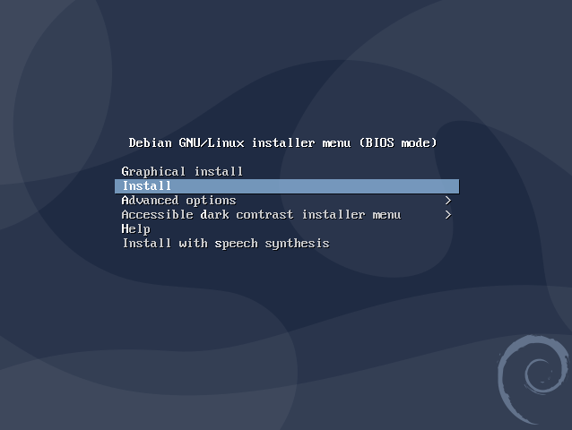
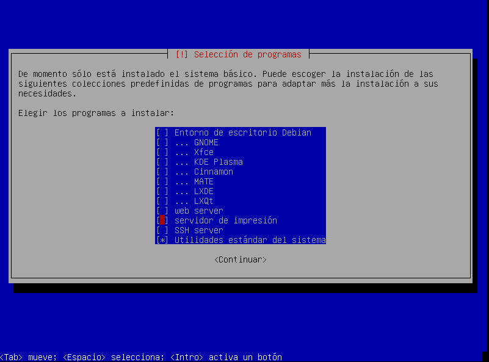
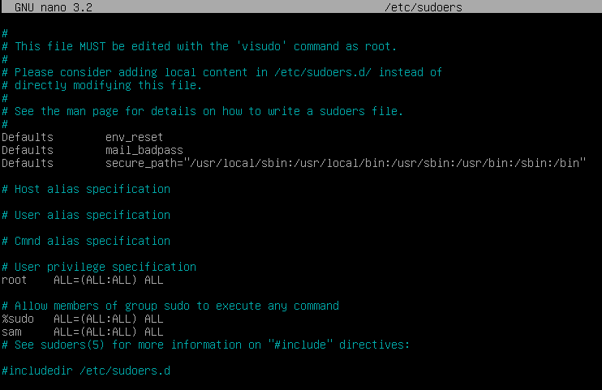
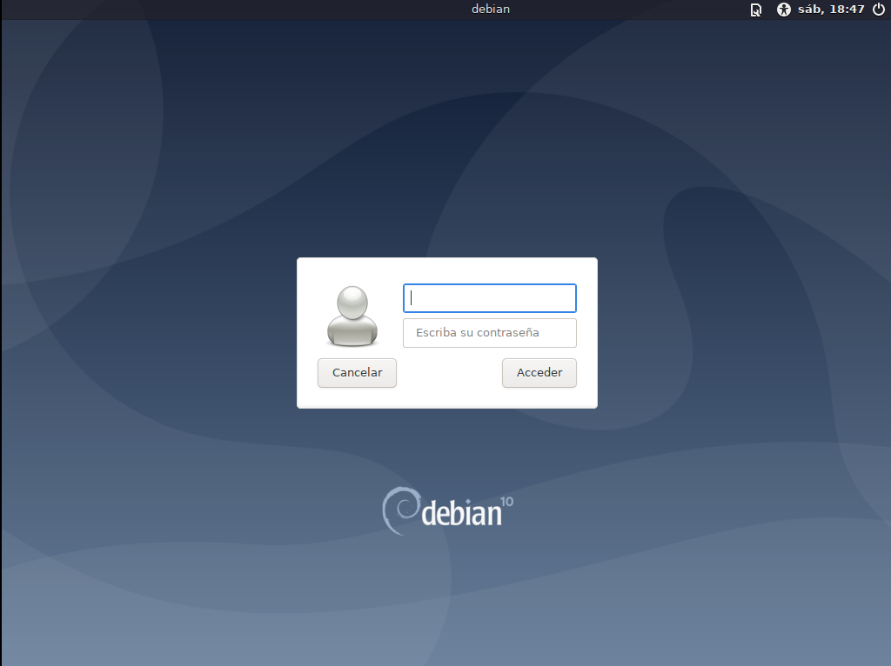
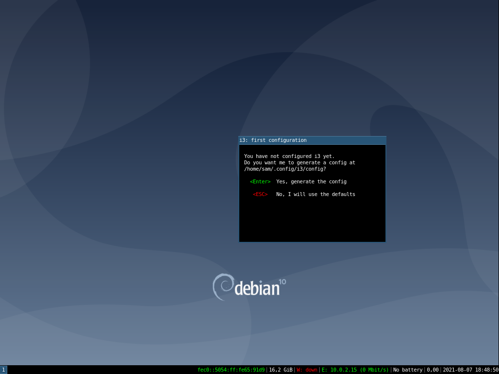
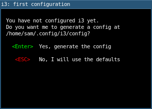
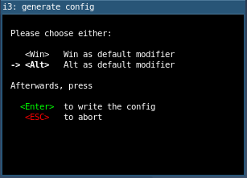
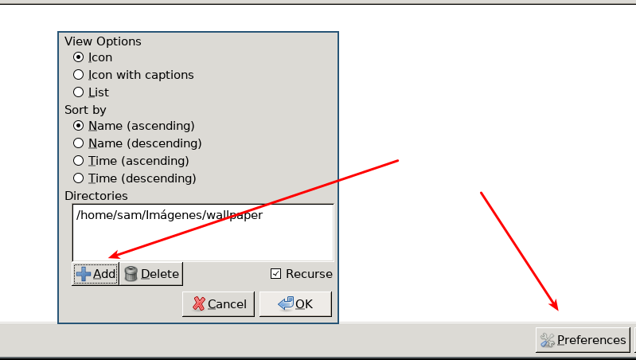

## Install base [debian](https://www.debian.org/)

Don't use the graphical installer



Select only standard system utilities



Add your usser to sudoers
```bash
su -l
apt-get install sudo
adduser {your-user-here} sudo
nano /etc/sudoers
```

Add this line after '%sudo' line
```
{your-user-here} ALL=(ALL:ALL) ALL
```
Example:


Update system
```bash
sudo apt-get update
sudo apt-get upgrade
```

Install x window server [xorg](https://es.wikipedia.org/wiki/X.Org_Server)
```bash
sudo apt install xorg
```

Install window manager [i3](https://i3wm.org/)
I'm not going to install i3 directly, I prefer to use the [i3-gaps](https://github.com/Airblader/i3) fork, for that I need to install other tools like git, gcc and make

```bash
sudo apt-get install i3status i3lock dmenu git gcc make lxappearance meson
```

Build i3-gaps

```bash
# clone the repository
git clone https://www.github.com/Airblader/i3 i3-gaps
cd i3-gaps

# compile
mkdir -p build && cd build
meson ..
ninja
meson install
```

i3-gaps dependences -> ([wiki](https://github.com/Airblader/i3/wiki/Building-from-source))

Intasll i3-gaps dependences (Debian)

```bash
apt install dh-autoreconf libxcb-keysyms1-dev libpango1.0-dev libxcb-util0-dev xcb libxcb1-dev libxcb-icccm4-dev libyajl-dev libev-dev libxcb-xkb-dev libxcb-cursor-dev libxkbcommon-dev libxcb-xinerama0-dev libxkbcommon-x11-dev libstartup-notification0-dev libxcb-randr0-dev libxcb-xrm0 libxcb-xrm-dev libxcb-shape0 libxcb-shape0-dev
```
Install i3-gaps dependences (Ubuntu)

```bash
sudo apt install -y libxcb1-dev libxcb-keysyms1-dev libpango1.0-dev \
libxcb-util0-dev libxcb-icccm4-dev libyajl-dev \
libstartup-notification0-dev libxcb-randr0-dev \
libev-dev libxcb-cursor-dev libxcb-xinerama0-dev \
libxcb-xkb-dev libxkbcommon-dev libxkbcommon-x11-dev \
autoconf libxcb-xrm0 libxcb-xrm-dev automake libxcb-shape0-dev
```


Install [LightDM](https://github.com/canonical/lightdm) as a display manager

```bash
sudo shutdown -r now
```

### Actual status

Lockscreen



Desktop



## Config i3

### Option 1 (Default config)
Press the "enter" key to generate an i3 configuration file.



Press the "win" key to select it as the default modifier and press enter again to save the setting.



### Option 2 (My own config)

I don't use the default configuration, instead I use my own repository.

```bash
wget -O ~/.config/i3/config https://raw.githubusercontent.com/VikingCodeBlog/i3-config/main/config
```
`Caution!` I use commands to open third-party applications, for the configuration to work 100%, you will need programs like [shutter](https://snapcraft.io/install/shutter/debian), [nitrogen](https://packages.debian.org/stretch/x11/nitrogen), [nvim](https://neovim.io/)...

## Install wallpapper

I use nitrogen to manage wallpapers.

```bash
sudo apt install nitrogen
```
Congig:
Open nitrogen -> preferences -> directories -> add your wallppaper directory



i3 with wallpaper


## Polybar

### Option 1 (Instal from repository)
[doc](https://github.com/polybar/polybar/wiki/Compiling)

It is necessary to install dependencies, some of them have already been installed together with i3-gaps

```bash
sudo apt-get install cmake cmake-data libcairo2-dev libxcb1-dev libxcb-ewmh-dev libxcb-icccm4-dev libxcb-image0-dev libxcb-randr0-dev libxcb-util0-dev libxcb-xkb-dev pkg-config python3-xcbgen xcb-proto libxcb-xrm-dev libasound2-dev libmpdclient-dev libiw-dev libcurl4-openssl-dev libpulse-dev python3-sphinx
```
Before Ubuntu 20.04 (focal) and Debian 11 (bullseye), you need to install the python-xcbgen package because the python3-xcbgen package does not exist for those versions.

```bash
sudo apt install python-xcbge
```

```bash
sudo apt install libxcb-composite0-dev
sudo apt install libjsoncpp-dev
sudo ln -s /usr/include/jsoncpp/json/ /usr/include/json
```

Clone polybar repository and build

```bash
git clone --recursive https://github.com/polybar/polybar.git
cd polybar && mkdir build && cd build && cdmake ..
```

```bash
mkdir build
cd build
cmake ..
make -j$(nproc)
# Optional. This will install the polybar executable in /usr/local/bin
sudo make install
```

### Option 2 (Install using apt - Debian )
```bash
sudo apt -t buster-backports install polybar
```

### Option 3 (Install from snap - Ubuntu)
```
sudo snap install polybar-git --edge --devmode
```

### Config polybar
[Config repository](https://github.com/VikingCodeBlog/polybar-config)
```
mkdir -p ~/.config/polybar/
wget -O ~/.config/polybar/ https://raw.githubusercontent.com/VikingCodeBlog/polybar-config/main/config
wget -O ~/.config/polybar/ https://raw.githubusercontent.com/VikingCodeBlog/polybar-config/main/launch.sh
chmod +x $HOME/.config/polybar/launch.sh
```


## ZSH
I use ZSH + OhMyZsh as a default shell

```bash
sudo apt-get install zsh
sudo apt-get install git-core
wget https://github.com/robbyrussell/oh-my-zsh/raw/master/tools/install.sh -O - | zsh
chsh -s `which zsh`
```

#### Config ZSH

This is my own config ([Repo](https://github.com/VikingCodeBlog/.zshrc))

'Caution! This will delete your current config'

```bash
rm ~/.zshrc
wget -O ~/.config/.zshrc https://raw.githubusercontent.com/VikingCodeBlog/.zshrc/main/.zshrc
ln -s ~/.config/.zshrc $HOME/.zshrc
```

## Add Gnome terminal color theme
This is my own config color scheme for Gnome Terminal ([Repo](https://github.com/VikingCodeBlog/Mjolnir-gnome-terminal-theme))


```bash
git clone https://github.com/VikingCodeBlog/Mjolnir-gnome-terminal-theme.git
cd Mjolnir-gnome-terminal-theme
bash install
```
